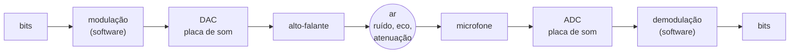
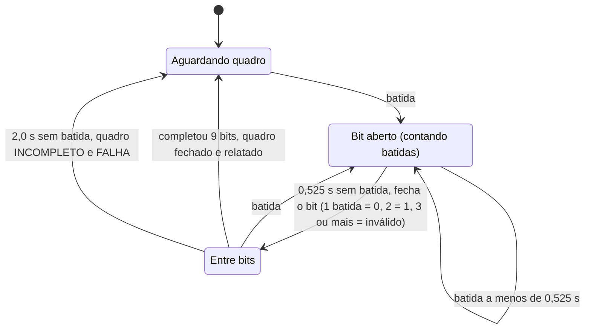

# Camada Física usando Som

[](LICENSE)


**Atividade 1 de Redes de Computadores: relatório técnico.**

Sistema completo de comunicação digital que usa **ondas sonoras no ar** como meio físico. Um único programa em Python faz o papel de **Emissor** e de **Receptor** e oferece dois métodos de transmissão. O **Método 1** usa batidas por impacto, em quadros de 9 bits com paridade par, e é interoperável entre equipes. O **Método 2** usa modulação MFSK de 16 tons com CRC-16 e chega a cerca de 133 bps teóricos. Nos dois métodos, cada quadro ou mensagem aparece no terminal como **[SUCESSO]** ou **[FALHA DE TRANSMISSÃO]**.

## Sumário

- [Vídeo de demonstração]https://www.youtube.com/shorts/iheMxCTJW6A
- [Equipe]Matheus Rodrigues de Oliveira
- [Como executar](#como-executar)
- [Estrutura de arquivos](#estrutura-de-arquivos)
- [1. Fundamentação Teórica](#1-fundamentação-teórica)
- [2. Engenharia e Arquitetura](#2-engenharia-e-arquitetura)
- [3. Divisão de Tarefas](#3-divisão-de-tarefas)
- [4. Desafios, Problemas e Soluções](#4-desafios-problemas-e-soluções)
- [5. Declaração do Uso de Inteligência Artificial](#5-declaração-do-uso-de-inteligência-artificial)
- [6. Conclusão](#6-conclusão)
- [Referências](#referências)
- [Licença](#licença)

---

## Vídeo de demonstração

**Vídeo do Professor:**

[](https://www.youtube.com/shorts/iheMxCTJW6A)

**Vídeo do Aluno:**

[


> **TODO equipe:** substituir `ID_DO_VIDEO` pelo ID real do vídeo. O vídeo deve mostrar, **nos dois métodos**, um caso de **sucesso** e um caso de **falha**. Para provocar a falha, use a opção `--erro` (veja [Como executar](#como-executar)).

Roteiro sugerido para o vídeo:

| Trecho | Comando | O que deve aparecer |
|---|---|---|
| M1, sucesso | `python main.py m1-receber` num PC e `python main.py m1-enviar "Oi"` (ou `--guiado`, batendo na mesa) no outro | `[SUCESSO] ... -> 'O'` e `[SUCESSO] ... -> 'i'` |
| M1, falha | `python main.py m1-enviar "Oi" --erro` | `[FALHA DE TRANSMISSÃO] ... -> paridade não confere` |
| M2, sucesso | `python main.py m2-receber` num PC e `python main.py m2-enviar "Olá, mundo"` no outro | `[SUCESSO] 'Olá, mundo' (CRC-16 confere)` |
| M2, falha | `python main.py m2-enviar "Olá, mundo" --erro` | `[FALHA DE TRANSMISSÃO] CRC não confere; ...` |
| Sem hardware | `python main.py m1-simular "Oi" --erro` e `python main.py m2-simular "Olá" --erro` | as mesmas linhas, simuladas no próprio PC |

---

## Equipe

> **TODO equipe:** Matheus rodrigues de Oliveira`Copyright (c) 2026 <nomes da equipe>` de todos os arquivos `.py`.

---

## Como executar

### Requisitos

- **Python 3.10 ou mais novo.** O código usa anotações como `int | None`. Foi desenvolvido e testado com Python 3.14.
- Placa de som com **alto-falante** (emissor) e **microfone** (receptor). Os comandos `*-simular` e os testes automáticos dispensam hardware.
- Bibliotecas: `numpy`, `sounddevice` (que acessa a placa de som pelo PortAudio) e `pytest`, todas listadas em [`requirements.txt`](requirements.txt). O `sounddevice` precisa estar instalado mesmo para os comandos `*-simular`, porque o `main.py` importa os módulos que tocam e gravam áudio. No Windows e no macOS o PortAudio já vem com o pacote; no Linux pode ser preciso instalar `libportaudio2`.

### Instalação

```bash
# 1. criar o ambiente virtual
python -m venv .venv

# 2. ativar
#    Windows (PowerShell):  .venv\Scripts\Activate.ps1
#    Windows (Git Bash):    source .venv/Scripts/activate
#    Linux / macOS:         source .venv/bin/activate

# 3. instalar as dependências
pip install -r requirements.txt
```

> **Acentos no terminal:** se no Git Bash os acentos aparecerem trocados, rode `export PYTHONIOENCODING=utf-8`. No PowerShell, o equivalente é `$env:PYTHONIOENCODING="utf-8"`. O problema é a codificação do console; o código não muda.

### Comandos do programa (`main.py`)

Sem argumentos, `python main.py` abre um **menu interativo** numerado de 0 a 6 com as mesmas opções. O menu pergunta o texto, se deve simular erro, o modo guiado, o ruído e a duração, conforme a opção.

| Comando | O que faz |
|---|---|
| `python main.py m1-enviar TEXTO [--guiado] [--erro]` | **Método 1, emissor.** Toca os "tocs" sintetizados no alto-falante. Com `--guiado`, mostra na tela o momento de cada batida (uma pessoa bate na mesa). Com `--erro`, inverte 1 bit do 1º quadro depois de calcular a paridade. |
| `python main.py m1-receber` | **Método 1, receptor.** Escuta o microfone em tempo real e imprime `.` a cada batida e uma linha SUCESSO/FALHA por quadro. **Ctrl+C** encerra e mostra o texto recebido e a contagem. |
| `python main.py m1-simular TEXTO [--erro] [--ruido NIVEL]` | **Método 1 sem hardware.** Gera o áudio, soma ruído gaussiano (desvio padrão `NIVEL`, padrão `0.02`) e decodifica. |
| `python main.py m2-enviar TEXTO [--erro]` | **Método 2, emissor.** Modula o texto (UTF-8) em MFSK e toca. Com `--erro`, inverte 1 bit dos dados depois de calcular o CRC. |
| `python main.py m2-receber [--duracao S]` | **Método 2, receptor.** Grava `S` segundos (padrão `10`), demodula e mostra SUCESSO/FALHA. **Inicie antes do emissor.** |
| `python main.py m2-simular TEXTO [--erro] [--ruido NIVEL]` | **Método 2 sem hardware.** Modulação, silêncio, ruído e demodulação. |
| `python main.py --help` / `python main.py m1-enviar --help` | Ajuda geral e ajuda de cada subcomando. |

Exemplos:

```bash
python main.py m1-simular "Redes"              # 5 quadros, todos [SUCESSO]
python main.py m1-simular "Oi" --erro          # 1º quadro [FALHA], 2º [SUCESSO]
python main.py m1-simular "Redes" --ruido 0.05 # sala mais barulhenta
python main.py m1-enviar "Oi" --guiado         # pessoa bate na mesa seguindo a tela
python main.py m2-simular "Camada Física!" --erro
python main.py m2-receber --duracao 20         # mensagens longas precisam de mais tempo
```

**Duração da gravação no Método 2.** O áudio dura cerca de **0,7 s + 60 ms por byte** de mensagem (UTF-8): 0,52 s fixos de silêncios e preâmbulo, mais 60 ms para cada byte de dados e para os 3 bytes de comprimento e CRC. Uma mensagem de 255 bytes, o máximo, dura cerca de 16 s, mais que os 10 s padrão. Nesse caso, use `--duracao`.

**Erros de entrada** geram mensagem amigável, sem traceback. São eles: caractere não-ASCII no Método 1 (por exemplo, `Olá`), texto vazio, ruído negativo, duração ≤ 0 e mensagem acima de 255 bytes no Método 2.

### Interface gráfica (`interface.py`)

```bash
python interface.py
```

Abre uma janela Tkinter que usa o **mesmo** `DetectorBatidas` e o **mesmo** `MontadorQuadros` do receptor de terminal. A janela mostra:

- o nível do microfone nos últimos 3 s, com as batidas em vermelho e o limiar em amarelo;
- as 9 casas do quadro sendo montado;
- a lista de quadros recebidos, com SUCESSO em verde e FALHA em vermelho;
- o texto recebido.

Pela janela também dá para enviar pelo Método 1 ou pelo Método 2, com a opção "Simular erro", e receber pelo Método 2 com gravação fixa de 10 s. O Tkinter já vem com o Python no Windows; no Linux pode ser preciso instalar o pacote `python3-tk`. Os testes automáticos não cobrem esta interface.

### Conferir o microfone (`teste_microfone.py`)

```bash
python teste_microfone.py
```

Fique em silêncio nos 2 primeiros segundos. O script mede o ruído de fundo (mediana do RMS de 200 janelas de 10 ms) e mostra o **mesmo limiar** que o receptor do Método 1 usa. Depois imprime cerca de 10 linhas por segundo com uma barra de nível e a marca `<-- BATIDA (passou do limiar)`. Serve para escolher o volume, a distância e a superfície da batida antes de gravar o vídeo. Ctrl+C encerra. Este arquivo **não** é um teste do pytest.

### Testes automáticos

```bash
python -m pytest -q
```

São 138 testes, que rodam em cerca de 10 s sem microfone nem alto-falante. Os testes usam sinais sintéticos e trocam `audio.tocar` e o microfone por versões falsas.

| Arquivo | Testes | O que cobre |
|---|---|---|
| `test_quadro.py` | 23 | conversão de bits, paridade par, validação, ida e volta em todo o ASCII |
| `test_metodo1_emissor.py` | 22 | instantes das batidas, síntese do "toc", erro simulado, modo guiado, ida e volta emissor→receptor |
| `test_metodo1_receptor.py` | 28 | detector (ruído, reverberação, ganho baixo, eco), montador de quadros, relatório, `escutar()` com microfone falso |
| `test_metodo2.py` | 35 | CRC-16, pacote, modulação/demodulação, ruído, deriva de relógio, gravação int16 e (N,1), erros no ar |
| `test_main.py` | 20 | linha de comando, menu, simulações, entradas inválidas |
| `test_integracao.py` | 10 | ponta a ponta dos dois métodos e `main.py` executado como processo |

---

## Estrutura de arquivos

```text
.
├── main.py                  # ponto de entrada: argparse (6 subcomandos), menu interativo, simulação offline
├── interface.py             # interface gráfica (Tkinter): nível do microfone, batidas, quadros, envio
├── config.py                # constantes compartilhadas: áudio, ritmo e detector do Método 1
├── audio.py                 # ÚNICO módulo que usa sounddevice: rms, tocar, gravar, janelas_do_microfone
├── quadro.py                # quadro de 9 bits do Método 1: caractere↔bits, paridade par, validação
├── metodo1_emissor.py       # Método 1, emissor: quadros → instantes → "tocs" (ou modo guiado)
├── metodo1_receptor.py      # Método 1, receptor: detector de batidas → bits → quadros → SUCESSO/FALHA
├── metodo2.py               # Método 2: MFSK 16 tons, preâmbulo chirp, CRC-16, modular/demodular
├── teste_microfone.py       # script manual: mede o ruído e mostra as batidas contra o limiar
├── test_quadro.py           # testes (pytest) do quadro e da paridade
├── test_metodo1_emissor.py  # testes do emissor do Método 1
├── test_metodo1_receptor.py # testes do receptor do Método 1
├── test_metodo2.py          # testes do Método 2
├── test_main.py             # testes da linha de comando (sem áudio)
├── test_integracao.py       # testes ponta a ponta dos dois métodos
├── requirements.txt         # numpy, sounddevice, pytest
├── .gitignore               # ignora .venv, caches e arquivos .wav
├── LICENSE                  # licença MIT
└── README.md                # este relatório
```

Os módulos de lógica (`quadro`, `metodo1_*`, `metodo2`) trabalham só com listas e vetores `numpy`. Só o `audio.py` fala com a placa de som. Por isso todo o processamento pode ser testado sem hardware.

---

## 1. Fundamentação Teórica

### 1.1 O Modelo ISO/OSI

O modelo de referência **OSI** (*Open Systems Interconnection*) da ISO divide a comunicação em 7 camadas. Cada camada usa os serviços da camada de baixo e oferece serviços à camada de cima. A **PDU** (*Protocol Data Unit*) é o nome da unidade de dados em cada camada.

| Nº | Camada | Função principal | Exemplos | PDU |
|---|---|---|---|---|
| 7 | Aplicação | Serviços de rede para o usuário e os programas | HTTP, DNS, SMTP, FTP | Dados / mensagem |
| 6 | Apresentação | Representação dos dados: codificação de caracteres, compressão, criptografia | ASCII, UTF-8, TLS (em parte), JPEG | Dados |
| 5 | Sessão | Abertura, controle e encerramento de diálogos; pontos de sincronização | RPC, NetBIOS | Dados |
| 4 | Transporte | Comunicação fim a fim entre processos; confiabilidade, controle de fluxo, portas | TCP, UDP | Segmento / datagrama |
| 3 | Rede | Endereçamento lógico e roteamento entre redes | IP, ICMP | Pacote |
| 2 | Enlace | Quadros entre nós vizinhos; delimitação, **detecção de erros**, acesso ao meio | Ethernet, Wi-Fi (MAC), PPP | Quadro |
| 1 | **Física** | Transmissão de **bits brutos** pelo meio: sinais, conectores, temporização | RS-232, 1000BASE-T, rádio, **som (este trabalho)** | Bit / símbolo |

Este trabalho fica na **camada 1** (o som carrega os bits) e toca a **camada 2**: o Método 1 delimita quadros e o Método 2 monta um pacote com comprimento e CRC.

### 1.2 A Camada Física em profundidade

#### Funções

A camada física não entende o significado dos bits. Ela os transforma em um fenômeno físico e de volta. Suas funções são:

- **Transmissão de bits brutos:** levar uma sequência de 0s e 1s de um ponto a outro.
- **Definição do meio:** cabo de cobre, fibra óptica, rádio ou, aqui, **o ar**, com ondas de pressão sonora.
- **Codificação / modulação:** como cada bit ou símbolo vira um sinal. No Método 1, o número de batidas. No Método 2, a frequência do tom.
- **Sincronização de bits:** o receptor precisa saber **onde** começa e termina cada bit. No Método 1, isso vem dos silêncios entre batidas. No Método 2, de um preâmbulo conhecido.
- **Taxa de transmissão:** quantos bits por segundo (bps) o canal carrega.
- **Topologia e interfaces:** aqui é um enlace ponto a ponto, *broadcast* acústico (todos na sala "ouvem"), *simplex* (um fala, o outro escuta). As interfaces elétricas e mecânicas são a placa de som, o alto-falante e o microfone.

#### Sinais analógicos e digitais

O som no ar é um **sinal analógico**: a pressão varia continuamente no tempo. O computador só lida com números, então a placa de som faz duas conversões:

- **DAC** (conversor digital-analógico) no emissor: amostras numéricas viram tensão, e a tensão move o cone do alto-falante.
- **ADC** (conversor analógico-digital) no receptor: o microfone vira tensão, e a tensão é **amostrada** (no tempo) e **quantizada** (em amplitude).

No código, o áudio é um vetor `numpy` `float32` com valores entre −1 e 1.



#### Largura de banda

A **largura de banda** $B$ de um canal é a faixa de frequências que ele deixa passar com pouca atenuação. O ouvido humano percebe de cerca de 20 Hz a 20 kHz, mas o canal real é limitado pelo pior componente:

- Alto-falantes de **notebook e celular** reproduzem mal abaixo de algumas centenas de Hz.
- Muitos microfones embutidos atenuam acima de 8 a 10 kHz.

Na prática, a faixa confiável fica em torno de **1 a 5 kHz**. É por isso que o Método 2 usa **1000 a 4950 Hz**.

A largura de banda limita a **taxa de símbolos**. Pelo **teorema de Nyquist** para um canal **sem ruído** com $M$ níveis (símbolos) distintos:

$$C_{\text{Nyquist}} = 2B \log_2 M$$

Por exemplo, com $B = 4000$ Hz e $M = 16$: $C = 2 \cdot 4000 \cdot 4 = 32\,000$ bps. É um teto ideal, sem ruído e sem eco. Na prática, cada símbolo precisa de tempo para ser distinguido com segurança (ver Método 2).

#### Taxa de amostragem

O projeto usa `TAXA_AMOSTRAGEM = 44100` amostras por segundo (`config.py`). O **teorema da amostragem de Nyquist-Shannon** diz que um sinal só é reconstruído sem perda se for amostrado a mais que o dobro de sua maior frequência:

$$f_s > 2 f_{\max} \quad\Rightarrow\quad f_{\max} < \frac{f_s}{2} = \frac{44\,100}{2} = 22\,050 \text{ Hz}$$

Uma componente acima de 22,05 kHz sofre **aliasing**: ela "dobra" e aparece como uma frequência falsa abaixo de 22,05 kHz. O tom mais agudo do Método 2 tem 4950 Hz (o chirp chega a 5000 Hz), bem abaixo do limite. Isso dá cerca de 9 amostras por período e nenhum risco de aliasing.

#### Modulação

Modular é variar uma propriedade de uma onda **portadora** $A\sin(2\pi f t + \varphi)$ de acordo com os dados:

| Técnica | O que varia | Vantagem | Problema no meio acústico |
|---|---|---|---|
| **ASK** (*Amplitude Shift Keying*) | amplitude $A$ | simples | o volume muda com a distância, o ganho do microfone e a direção. Distinguir "alto" de "baixo" é frágil. |
| **FSK** (*Frequency Shift Keying*) | frequência $f$ | robusta a variações de amplitude | ocupa mais banda |
| **PSK** (*Phase Shift Keying*) | fase $\varphi$ | eficiente em banda | exige referência de fase precisa; eco e diferença de relógio entre placas de som embaralham a fase |
| **MFSK** (*M-ary FSK*) | uma entre $M$ frequências | $\log_2 M$ bits por símbolo, mantendo a robustez da FSK | mais tons para separar |

**Por que FSK/MFSK no ar.** A amplitude que chega ao microfone é imprevisível, porque depende da distância, do volume e do microfone. Já a **frequência** de um tom não muda no caminho. O receptor FSK não pergunta "qual o volume?". Ele pergunta "**qual das frequências tem mais energia?**", uma comparação **relativa** que funciona com o sinal forte ou fraco. Isso não exige referência de fase, o que a torna imune a inversão de polaridade e a pequenas diferenças de relógio.

O Método 1 é, a rigor, uma modulação **por pulsos**: a informação está no **número de pulsos** (batidas) por bit, e não na amplitude.

#### Ruído e degradações do canal

| Degradação | Origem | Efeito |
|---|---|---|
| **Ruído térmico** | agitação de elétrons no microfone e no ADC | "chiado" de fundo, de espectro largo |
| **Ruído ambiente** | ventilador, ar-condicionado, conversas, trânsito | concentrado nos graves; pode mascarar batidas |
| **Ruído impulsivo** | porta batendo, objeto caindo, tosse | picos curtos que parecem batidas |
| **Eco / reverberação** | reflexões em paredes, mesa e teto | cópias atrasadas do sinal; uma batida "dupla"; tons que vazam para o símbolo seguinte |
| **Atenuação** | o som se espalha (cerca de −6 dB a cada dobro de distância em campo livre) | sinal mais fraco e SNR menor longe do emissor |

A qualidade do canal é medida pela **relação sinal-ruído** (SNR), normalmente em decibéis:

$$\text{SNR}_{\text{dB}} = 10 \log_{10}\frac{P_{\text{sinal}}}{P_{\text{ruído}}}$$

O **limite de Shannon** (1948) dá a capacidade máxima de um canal **com ruído** gaussiano, qualquer que seja a modulação:

$$C = B \log_2(1 + \text{SNR})$$

**Exemplo numérico.** Para a faixa do Método 2, $B = 4000$ Hz (de 1 a 5 kHz), numa sala com SNR de 20 dB, temos $\text{SNR} = 10^{20/10} = 100$ e

$$C = 4000 \cdot \log_2(101) \approx 4000 \cdot 6{,}66 \approx 26{,}6 \text{ kbps}.$$

O Método 2 usa 133 bps, cerca de 0,5% desse limite. A folga é proposital: Shannon supõe ruído branco e codificação ideal, mas o ar real tem eco, distorção do alto-falante e ruído não estacionário. Trocamos taxa por **confiabilidade**.

### 1.3 Detecção de Erros

Nenhum meio físico é perfeito, e alguns bits chegam trocados. **Detectar erros** é acrescentar à mensagem uma **redundância** calculada a partir dos dados. O receptor recalcula essa redundância e compara: se não conferir, a mensagem é marcada como corrompida. Detectar não é **corrigir**. Neste trabalho, um quadro corrompido é apenas reportado como **FALHA DE TRANSMISSÃO**.

#### Paridade par (Método 1)

O emissor acrescenta 1 bit para que o total de bits 1 no quadro seja **par**:

$$b_9 = b_1 \oplus b_2 \oplus \dots \oplus b_8$$

$b_9 = 0$ se a quantidade de 1s nos dados for par, e $b_9 = 1$ se for ímpar.

| Situação | Dados | Paridade | Nº de 1s (dados + paridade) | Resultado |
|---|---|---|---|---|
| Enviado: `'A'` | `01000001` | `0` | 2 (par) | — |
| **1 bit** trocado (1º bit) | `11000001` | `0` | 3 (ímpar) | **detectado** |
| **2 bits** trocados (7º e 8º) | `01000010` (= `'B'`) | `0` | 2 (par) | **não detectado**: o receptor aceita `'B'` |
| **3 bits** trocados | `11000010` | `0` | 3 (ímpar) | detectado |

Isso mostra a regra geral: a paridade detecta **qualquer número ímpar** de bits errados e **nenhum número par**. Em batidas, um erro típico é perder ou ganhar uma batida, o que troca 1 bit; nesses casos a paridade funciona. Duas batidas erradas no mesmo quadro passam despercebidas. Um teste em `test_quadro.py` mostra essa limitação de propósito.

#### CRC-16/CCITT (Método 2)

O **CRC** (*Cyclic Redundancy Check*) trata a mensagem como um polinômio com coeficientes em $\mathrm{GF}(2)$, isto é, bits em que soma e subtração são **XOR**. O emissor divide esse polinômio por um **polinômio gerador** $G(x)$ e envia o **resto** junto com a mensagem. O receptor refaz a divisão: se o resto não bater, houve erro.

O projeto usa o **CRC-16/CCITT-FALSE**:

$$G(x) = x^{16} + x^{12} + x^{5} + 1 \quad\longrightarrow\quad \texttt{0x1021}$$

- Valor inicial `0xFFFF`, sem reflexão de bits nem XOR final.
- Valor de conferência: `crc16_ccitt(b"123456789") == 0x29B1` (testado em `test_metodo2.py`).
- A implementação em `metodo2.crc16_ccitt` é **bit a bit**, para ser didática. Para cada bit, se o bit mais alto do registrador é 1, o polinômio "cabe" e é subtraído com XOR. Essa é a divisão longa binária.

Garantias do CRC-16 com esse gerador, para mensagens de até 32 767 bits:

- detecta **todos os erros de 1 bit e de 2 bits**;
- detecta **todos os erros com número ímpar de bits**, porque $G(x)$ tem o fator $(x+1)$;
- detecta **todas as rajadas** (*bursts*) de até **16 bits** e a grande maioria das rajadas maiores (deixa passar cerca de $1/2^{16} \approx 0{,}0015\%$ dos erros aleatórios).

`test_metodo2.py` confere exaustivamente que **todos** os erros de 1 e 2 bits num pacote de 6 bytes (a mensagem `"Oi!"`) são detectados.

#### Comparação e escolha

| Técnica | Bits extras | Detecta | Corrige | Comentário |
|---|---|---|---|---|
| Paridade simples | 1 | erros ímpares | não | obrigatória no Método 1; fraca |
| *Checksum* (soma) | 8–16 | muitos erros, mas não troca de ordem nem erros que se cancelam | não | simples, porém mais fraco que CRC |
| **CRC-16** | 16 | 1 e 2 bits, ímpares, rajadas ≤ 16 | não | **escolhido para o Método 2** |
| Hamming (7,4) | 3 a cada 4 | 2 bits | 1 bit | corrige, mas custa 75% de *overhead* |

**Por que CRC-16 no Método 2.** Ele custa apenas **2 bytes por mensagem**, qualquer que seja o tamanho. É muito mais forte que paridade ou *checksum*. Pega exatamente o tipo de erro mais provável no MFSK: **um símbolo trocado** muda até 4 bits vizinhos, que é uma rajada curta. E o mesmo polinômio gerador é usado em protocolos reais (X.25, HDLC, Bluetooth), que só mudam detalhes como o valor inicial e a reflexão de bits. Hamming permitiria **corrigir** erros, mas reduziria a taxa útil em quase metade. Como o enunciado pede apenas **detectar**, CRC foi o melhor custo-benefício.

---

## 2. Engenharia e Arquitetura

### 2.1 Visão geral do fluxo

```mermaid
flowchart TB
    subgraph M1["Método 1 - batidas"]
        direction LR
        T1["texto ASCII"] --> Q1["quadro.py<br/>8 bits + paridade par"] --> I1["metodo1_emissor<br/>quadro → instantes"]
        I1 --> S1["sintetizar 'tocs'<br/>(alto-falante)"]
        I1 --> G1["modo guiado<br/>(pessoa bate na mesa)"]
        S1 --> AR1(("ar"))
        G1 --> AR1
        AR1 --> D1["DetectorBatidas<br/>janelas de 10 ms, RMS, limiar"] --> MQ["MontadorQuadros<br/>batidas → bits → quadros"] --> R1["relatar_quadro<br/>SUCESSO / FALHA"]
    end
    subgraph M2["Método 2 - MFSK"]
        direction LR
        T2["texto UTF-8"] --> P2["montar_pacote<br/>comprimento + dados + CRC-16"] --> MOD["modular<br/>chirp + tons MFSK"] --> AR2(("ar")) --> SY["correlação<br/>acha o chirp"] --> DEM["energia dos 16 tons<br/>por símbolo"] --> CRC["confere CRC-16"] --> R2["relatar_mensagem<br/>SUCESSO / FALHA"]
    end
```



### 2.2 Método 1: batidas por impacto (obrigatório, interoperável)

#### Codificação e quadro

- **Bit 0** = silêncio + **1 batida** + silêncio.
- **Bit 1** = silêncio + **2 batidas** consecutivas + silêncio.
- **Quadro** = 9 bits: 8 bits de dados (código ASCII do caractere, **MSB primeiro**) + 1 bit de **paridade par**.

O quadro é montado em `quadro.py`, escrito pela equipe:

```text
Caractere 'A'  →  código ASCII 65  →  0 1 0 0 0 0 0 1 | 0
                                       b1 ...........b8 | b9 (paridade: dois 1s → par → 0)
```

Linha do tempo das batidas de `'A'`, gerada por `quadro_para_instantes`:

| Bit | b1=0 | b2=1 | b3=0 | b4=0 | b5=0 | b6=0 | b7=0 | b8=1 | b9=0 |
|---|---|---|---|---|---|---|---|---|---|
| Batidas (s) | 0,00 | 0,80 e 1,05 | 1,85 | 2,65 | 3,45 | 4,25 | 5,05 | 5,85 e 6,10 | 6,90 |

O receptor separa os 8 primeiros bits, recalcula a paridade e compara com o 9º. Para isso usa `validar_quadro` de `quadro.py`, dentro de `quadro_integro`.

#### Regras de tempo (`config.py`)

| Constante | Valor | Significado |
|---|---|---|
| `INTERVALO_BATIDAS` | 0,25 s | tempo entre as 2 batidas de um bit 1 |
| `SILENCIO_BITS` | 0,8 s | da última batida de um bit até a 1ª do próximo |
| `LIMITE_GRUPO` | (0,25 + 0,8) / 2 = **0,525 s** | batidas mais próximas que isso são do **mesmo bit**; um silêncio maior **fecha o bit** |
| `PERIODO_REFRATARIO` | 0,08 s | uma nova "batida" dentro desse intervalo é eco ou rebote da mesma e é ignorada |
| `TIMEOUT_QUADRO` | 2,0 s | sem batidas por 2 s, o quadro pela metade é fechado **incompleto** e vira FALHA |
| `PAUSA_ENTRE_QUADROS` | `TIMEOUT_QUADRO + 0,5` = 2,5 s | o emissor espera isso entre quadros, para o receptor fechar o anterior |

**Por que `LIMITE_GRUPO` é a média.** O receptor só vê dois tipos de intervalo: o **curto**, dentro de um bit 1 (0,25 s), e o **longo**, entre bits (0,8 s). O ponto do meio, 0,525 s, deixa a **mesma margem** (0,275 s) para os dois lados. Assim um atraso humano ou de áudio tem a maior tolerância possível antes de mudar a interpretação. `LIMITE_GRUPO` é **calculado** a partir das outras duas constantes; se a equipe mudar o ritmo, ele se ajusta sozinho.

**Tolerância para interoperar.** Na prática, o receptor aceita batidas de **outras equipes** desde que três condições valham. O intervalo dentro de um bit 1 deve ficar entre **0,08 s e 0,525 s**. O silêncio entre bits deve ficar entre **0,525 s e 2,0 s**. Os quadros devem estar separados por mais de 2,0 s.

**Taxa do Método 1.** Do primeiro ao último toc, um quadro dura $8 \times 0{,}6 + n_1 \times 0{,}15$ s, em que $n_1$ é o número de bits 1 entre os 9. Somando a pausa de 2,5 s, cada caractere leva **de 8,9 s a 10,9 s** ($n_1$ vai de 0 a 8: o bit mais alto de um caractere ASCII é sempre 0 e, com a paridade par, o total de 1s é sempre par). Isso dá **≈ 0,73 a 0,90 bps** de dados úteis. Na simulação, `"Redes"` (40 bits de dados) gerou 48,1 s de áudio, ou **≈ 0,83 bps**.

#### Ajuste ao vídeo de referência

O ritmo do protocolo foi tomado do vídeo de referência da disciplina (<https://youtube.com/shorts/iheMxCTJW6A>). Os valores de `config.py` (0,25 s entre as batidas de um bit 1 e 0,8 s entre bits) representam **a cadência adotada pela equipe** para essa referência. **Eles não vêm de uma medição precisa do vídeo.**

> **TODO equipe:** medir o vídeo de referência, abrindo o áudio no Audacity e marcando o início de cada batida. Conferir `INTERVALO_BATIDAS` e `SILENCIO_BITS` e ajustá-los se necessário. `LIMITE_GRUPO` e `PAUSA_ENTRE_QUADROS` são recalculados automaticamente.

#### Detector de batidas (`metodo1_receptor.DetectorBatidas`)

1. **Janelas de 10 ms.** O áudio é cortado em janelas de `AMOSTRAS_POR_JANELA = 441` amostras (10 ms a 44,1 kHz). É curto o bastante para separar batidas a 80 ms e longo o bastante para uma medida estável.
2. **RMS.** Cada janela vira um número, sua energia média:
   $$\text{RMS} = \sqrt{\frac{1}{N}\sum_{n=1}^{N} x[n]^2}$$
3. **Ruído de fundo adaptativo.** É a **mediana** do RMS das últimas `JANELAS_RUIDO = 100` janelas **sem batida** (1 s). A mediana ignora picos isolados. Só janelas sem batida entram nessa conta, para que as próprias batidas não inflem o ruído.
4. **Limiar:**
   $$\text{limiar} = \max(\texttt{LIMIAR\_MINIMO},\ \texttt{FATOR\_LIMIAR} \times \text{ruído}) = \max(0{,}01,\ 4 \times \text{ruído})$$
5. **Nova batida = salto de volume.** A janela precisa passar do limiar **e** ser pelo menos `FATOR_SUBIDA = 2` vezes mais forte que a janela de **20 ms atrás**. É uma borda de subida robusta. A comparação é com 20 ms, e não 10 ms, porque a batida pode cair na divisa entre duas janelas. Exigir o salto resolve a reverberação: a 2ª batida de um bit 1 chega enquanto o "rabo" da 1ª ainda está acima do limiar, e o salto a revela.
6. **Período refratário.** Bordas a menos de 80 ms da última batida são ignoradas.
7. **Aquecimento.** As primeiras `JANELAS_AQUECIMENTO = 10` janelas (100 ms) só medem o ruído.
8. **Som longo não é batida.** Algo acima do limiar por mais de `DURACAO_MAXIMA_BATIDA = 0,3` s, como um ventilador ligando, entra no histórico de ruído, e o limiar sobe.

O instante de cada batida é contado pelo **número de janelas** (índice × 10 ms), e não pelo relógio do PC. Assim ele acompanha o áudio exatamente, mesmo que o computador atrase.

#### Máquina de estados do receptor (`MontadorQuadros`)



Um bit com 3 ou mais batidas é guardado como `BIT_INVALIDO = -1`. Por isso o receptor decide a integridade com `quadro_integro()`, que exige **9 bits**, **nenhum −1** e **paridade correta**. A função `validar_quadro` sozinha contaria o −1 como 0 na paridade.

#### Modos de emissão

- **Automático (alto-falante):** `sintetizar_batidas` gera cada "toc" como ruído branco com decaimento exponencial. São 25 ms de duração (`DURACAO_TOC`), constante de tempo de 6 ms (`DECAIMENTO_TOC`) e pico de 0,8 (`AMPLITUDE_TOC`), com 0,3 s de silêncio nas bordas. O ataque instantâneo facilita a detecção da borda, e o "rabo" curto evita uma batida dupla falsa.
- **Guiado (`--guiado`):** para batidas **manuais** (caneta na mesa, palmas). Depois de uma contagem regressiva de 3 s, o programa imprime `TOC! (bit N = v)` no instante exato de cada batida, medido com `time.perf_counter`. Os instantes vêm da mesma função `quadro_para_instantes`, então o ritmo é idêntico ao do modo automático.

### 2.3 Método 2: MFSK de 16 tons com CRC-16 (livre)

#### Técnica escolhida

**MFSK** (*Multiple Frequency Shift Keying*): cada símbolo é **um tom puro** entre 16 possíveis. Como $16 = 2^4$, cada símbolo carrega **4 bits**, e cada byte vira 2 símbolos (metade alta primeiro). Para resistir à reverberação, símbolos vizinhos usam **bancos de frequência diferentes em rodízio**. O símbolo na posição $i$ usa o banco $i \bmod 5$, e cada banco tem 16 tons próprios. Um banco só volta a ser usado 150 ms depois, quando o eco do símbolo anterior já enfraqueceu.

| Parâmetro (`metodo2.py`) | Valor | Justificativa |
|---|---|---|
| `QUANTIDADE_TONS` / `BITS_POR_SIMBOLO` | 16 tons / 4 bits | $\log_2 16 = 4$ |
| `FREQUENCIA_BASE` | 1000 Hz | acima dos graves, onde estão o ruído ambiente e a resposta fraca de alto-falantes pequenos |
| `ESPACAMENTO` | 50 Hz | $= 1/\texttt{DURACAO\_UTIL}$: tons **ortogonais** na janela analisada |
| `BANCOS` | 5 | rodízio contra reverberação |
| Faixa total | 1000 a 4950 Hz | $1000 + (5 \cdot 16 - 1)\cdot 50 = 4950$ Hz |
| `GUARDA` | 10 ms | trecho do início de cada símbolo que o receptor **ignora** (ecos curtos) |
| `DURACAO_UTIL` | 20 ms | trecho analisado |
| `DURACAO_SIMBOLO` | 30 ms | guarda + útil |
| `RAMPA` | 2 ms | subida e descida suaves (meia senoide) para não gerar "cliques" |
| `AMPLITUDE` | 0,8 | pico do sinal (máximo da placa = 1,0) |
| Preâmbulo | chirp linear de 1 → 5 kHz, 100 ms, mais 20 ms de pausa | sincronização |
| `LIMIAR_PREAMBULO` | 0,3 | correlação normalizada mínima para aceitar o preâmbulo |
| `SILENCIO_BORDAS` | 0,2 s | antes e depois do sinal |
| `TAMANHO_MAXIMO` | 255 bytes | o comprimento ocupa 1 byte |

Frequência do símbolo $s$ ($0 \le s \le 15$) na posição $i$:

$$f(s, i) = 1000 + \big(16 \cdot (i \bmod 5) + s\big)\cdot 50 \ \text{Hz}$$

#### Formato do pacote

```text
 [silêncio 0,2 s][ PREÂMBULO chirp 100 ms ][pausa 20 ms][ COMPRIMENTO 1 B | DADOS 0..255 B | CRC-16 2 B ][silêncio 0,2 s]
                                                          └────────── coberto pelo CRC ─────┘
```

Exemplo: a mensagem `"A"` gera o pacote `01 41 76 DB`. São 8 símbolos `0,1,4,1,7,6,13,11`, tocados em 1000, 1850, 2800, 3450, 4550, 1300, 2450 e 3150 Hz. O áudio total tem 0,76 s.

#### Sincronização por correlação

O receptor grava um trecho longo e não sabe onde a mensagem começa. Ele calcula a **correlação cruzada normalizada** entre a gravação e o chirp conhecido:

$$\rho[k] = \frac{\left|\sum_n x[k+n]\, p[n]\right|}{\sqrt{\sum_n x[k+n]^2 \cdot \sum_n p[n]^2}} \in [0, 1]$$

- O cálculo é feito pela **FFT**: multiplicar espectros equivale a correlacionar no tempo. Isso é rápido mesmo em gravações de 20 s.
- A divisão pela energia torna $\rho$ **independente do volume**.
- O valor absoluto torna $\rho$ imune à **inversão de polaridade** do microfone.
- Um chirp largo (1 a 5 kHz) produz um pico de correlação **estreito**, então a posição sai com precisão de poucas amostras. Em ruído puro, o pico fica em torno de 0,07 a 0,1.

#### Demodulação

Para cada símbolo, o receptor pula os 10 ms de guarda e, nos 20 ms úteis (882 amostras), mede a energia dos 16 tons do banco daquela posição. Para isso calcula a **DFT só nessas 16 frequências**: multiplica o trecho por $e^{-j2\pi f t}$ e soma, o mesmo resultado que o algoritmo de Goertzel. O símbolo escolhido é o de **maior energia**. Como a decisão é uma comparação **relativa** entre tons, o volume absoluto não importa. Com espaçamento de 50 Hz em 20 ms, um tom puro dá energia (quase) zero nos outros 15.

#### Taxa teórica vs. efetiva

**Taxa teórica** (`metodo2.taxa_teorica_bps()`):

$$R = \frac{\text{bits por símbolo}}{\text{duração do símbolo}} = \frac{\log_2 16}{0{,}010 + 0{,}020\ \text{s}} = \frac{4}{0{,}030} \approx 133{,}3\ \text{bps}$$

**Taxa efetiva.** O *overhead* fixo é de 0,2 s + 0,1 s + 0,02 s + 0,2 s = 0,52 s, mais 3 bytes de comprimento e CRC (6 símbolos = 0,18 s):

$$T(n) \approx 0{,}52 + 0{,}06\,(n + 3)\ \text{s}, \qquad R_{\text{efetiva}} = \frac{8n}{T(n)}$$

Valores calculados sobre o áudio que `modular` produz (sem ruído):

| Mensagem | Bytes (UTF-8) | Duração do áudio | Taxa efetiva | Sem os silêncios de borda |
|---|---|---|---|---|
| `"Oi"` | 2 | 0,82 s | 19,5 bps | 38,1 bps |
| `"Camada Física!"` | 15 | 1,60 s | 75,0 bps | 100,0 bps |
| 255 bytes (máximo) | 255 | 16,0 s | 127,5 bps | — |

Mensagens curtas são dominadas pelo *overhead*. Mensagens longas se aproximam dos 133 bps teóricos.

#### Resultados de robustez (**SIMULAÇÃO**, não medição no ar)

Ruído gaussiano branco somado digitalmente (desvio padrão relativo ao fundo de escala ±1; pico do sinal = 0,8):

**Método 1** (`"Redes"`, 5 execuções × 5 quadros):

| Desvio do ruído | Quadros corretos | Mensagens inteiras |
|---|---|---|
| 0 a 0,06 | 25/25 | 5/5 |
| 0,07 a 0,10 | 0/25 | 0/5 (nenhuma batida detectada) |

A queda é abrupta. O limiar é 4 × ruído; com desvio 0,07 ele vale 0,28 e passa do RMS de pico de um "toc" (≈ 0,27).

**Método 2** (`"Camada Física!"`, 10 execuções):

| Desvio do ruído | Sucesso | CRC acusou falha | Preâmbulo não achado / incompleto |
|---|---|---|---|
| 0,02 a 1,5 | 10/10 | 0 | 0 |
| 2,0 a 3,0 | 0/10 | 0 | 10/10 |

Em **nenhuma** execução houve um falso SUCESSO: toda mensagem que não chegou íntegra foi reportada como FALHA. O Método 2 tolera muito mais ruído branco que o Método 1 porque cada decisão integra 882 amostras numa única frequência (ganho de processamento). O "toc" do Método 1, ao contrário, é um ruído de banda larga e compete com o ruído em todas as frequências.

Outros cenários simulados nos testes do Método 2, todos com sucesso:

- volume reduzido a 10% (ganho 0,1) com ruído;
- eco de 5 a 10 ms com metade da amplitude;
- polaridade invertida;
- *offset* DC com zumbido de 60 Hz;
- diferença de relógio de 300 ppm entre as placas;
- receptor a 48 kHz.

Numa sala simulada com reverberação (RT60 = 0,5 s), o rodízio de 5 bancos reduziu a taxa de erro de símbolo de cerca de 10% (banco único) para menos de 1%. O valor exato depende do modelo de sala usado na simulação.

#### Medição no ar

> **TODO equipe:** preencher após teste com alto-falante e microfone reais. Não há medições reais neste relatório até agora.

| Método | Mensagem | Distância | Ambiente | Tentativas | Sucessos | Duração medida | Taxa efetiva |
|---|---|---|---|---|---|---|---|
| 1 (alto-falante) | TODO equipe | TODO | TODO | TODO | TODO | TODO | TODO |
| 1 (guiado, batida manual) | TODO equipe | TODO | TODO | TODO | TODO | TODO | TODO |
| 2 | TODO equipe | TODO | TODO | TODO | TODO | TODO | TODO |

### 2.4 Comparação Método 1 × Método 2

| | Método 1 (batidas) | Método 2 (MFSK) |
|---|---|---|
| Codificação | nº de batidas por bit (1 ou 2) | 1 de 16 tons por símbolo |
| Bits por símbolo | 1 | 4 |
| Unidade | quadro de 9 bits por caractere | pacote de até 255 bytes |
| Caracteres | ASCII (0–127) | qualquer texto UTF-8 (acentos) |
| Sincronização | silêncios (agrupamento por tempo) | preâmbulo chirp + correlação |
| Detecção de erro | paridade par (1 bit / 8) | CRC-16 (16 bits / mensagem) |
| Taxa teórica | ≈ 1,3 a 1,7 bps dentro do quadro | **133,3 bps** |
| Taxa efetiva (simulação) | ≈ **0,83 bps** (`"Redes"`) | **75 bps** (`"Camada Física!"`), até 127,5 bps |
| Pode ser feito por pessoa | sim (modo guiado) | não |

O Método 2 é cerca de **70 vezes mais rápido** na mensagem de exemplo e mais de 100 vezes nas longas. O Método 1, por outro lado, é simples a ponto de uma pessoa transmitir com uma caneta, e é isso que permite a interoperabilidade entre equipes.

---

## 3. Divisão de Tarefas

> **TODO equipe:** preencher com o que **cada membro** realmente fez. As áreas abaixo são uma sugestão de divisão; troquem pelos nomes e ajustem as descrições.

| Membro | Contribuições |
|---|---|
| \<nome\> | `quadro.py` e paridade par; `test_quadro.py` |
| \<nome\> | Emissor do Método 1 (`metodo1_emissor.py`): ritmo, síntese do "toc", modo guiado |
| \<nome\> | Receptor do Método 1 (`metodo1_receptor.py`, `teste_microfone.py`): detector, montador de quadros, calibração |
| \<nome\> | Método 2 (`metodo2.py`): MFSK, preâmbulo, CRC-16, testes de taxa |
| \<nome\> | `main.py`, `interface.py`, README/relatório, gravação e edição do vídeo |

---

## 4. Desafios, Problemas e Soluções

| Problema | Onde aparece | Como o código trata |
|---|---|---|
| **Ruído ambiente** variando de sala para sala | M1 | limiar **adaptativo**: 4 × mediana do ruído do último 1 s sem batidas, com piso de 0,01. O `teste_microfone.py` mostra o limiar real. |
| **Batida dupla / rebote / eco** | M1 | **período refratário** de 80 ms; exigência de **salto de 2×** em relação a 20 ms atrás (o rabo decrescente do eco não salta) |
| **Reverberação** mascarando a 2ª batida de um bit 1 | M1 | a regra do salto detecta a 2ª batida mesmo com o rabo da 1ª acima do limiar (testado com RT60 de até 1 s, em simulação) |
| **Batida perdida / perda de sincronismo** | M1 | `TIMEOUT_QUADRO` de 2 s fecha o quadro **incompleto**, reportado como `[FALHA DE TRANSMISSÃO] ... quadro incompleto com N bits`. A `PAUSA_ENTRE_QUADROS` de 2,5 s garante que um quadro ruim não "contamine" o próximo: o receptor se ressincroniza no quadro seguinte. |
| **3 ou mais batidas** num bit | M1 | o bit vira `BIT_INVALIDO` (−1) e o quadro sai como `bit inválido (3 ou mais batidas)` |
| **Barulho contínuo** (ventilador ligando) | M1 | som acima do limiar por mais de 0,3 s é tratado como ruído, e o limiar sobe |
| **Caracteres não-ASCII** (`á`, `ç`, `€`) | M1 | `caractere_para_bits` lança `ValueError`; `main.py` mostra `Erro na entrada: 'á' não é um caractere ASCII` sem traceback. No M2 os acentos funcionam (UTF-8). |
| **Achar o início da mensagem** | M2 | preâmbulo chirp + correlação cruzada normalizada pela FFT (independe do volume e da polaridade) |
| **Eco / reverberação** entre símbolos | M2 | **guarda** de 10 ms ignorada pelo receptor, mais o **rodízio de 5 bancos** de frequência |
| **Cliques espectrais** (início e fim abrupto do tom espalham energia por todas as frequências) | M2 | **rampas** de 2 ms em meia senoide em cada tom e no chirp |
| **Ganho variável** (distância, volume, microfone) | M2 | MFSK decide pelo tom de **maior energia relativa**; testado com o volume reduzido a 10% |
| **Gravação** em formato `(amostras, 1)` ou `int16` | M2 | `demodular` usa o 1º canal e converte para `float64` |
| **Mensagem longa** maior que a gravação | M2 | `m2-receber --duracao S`; a dica de duração aparece quando o pacote fica incompleto |
| **Erros em número par** passam pela paridade | M1 | limitação conhecida do protocolo obrigatório (ver [1.3](#13-detecção-de-erros)); o CRC-16 do M2 não tem essa fraqueza |

### Como os algoritmos de verificação identificaram quadros corrompidos

Saída real de `python main.py m1-simular "Oi" --erro`. O `'O'` (`01001111`, paridade 1) teve o 1º bit invertido **depois** do cálculo da paridade, e o receptor contou seis 1s nos dados (paridade esperada 0) contra a paridade recebida 1:

```text
Simulando erro: 1 bit de dados do 1º quadro foi invertido depois da paridade.
Enviando 2 quadro(s), 29 batidas, 14.4 s de áudio, ruído com desvio 0.02.

[FALHA DE TRANSMISSÃO] 11001111 1 -> paridade não confere
[SUCESSO] 01101001 0 -> 'i'

Texto recebido: '?i'
Quadros enviados: 2   recebidos: 2
Resumo: 1 sucesso(s) / 1 falha(s)
```

Saída real de `python main.py m2-simular "Camada Física!" --erro`. O bit mais baixo do 1º byte de dados foi invertido depois do CRC (`'C'` = `0x43` virou `0x42` = `'B'`). O CRC recalculado no receptor não confere:

```text
Simulando erro: 1 bit dos dados foi invertido depois do cálculo do CRC.
Mensagem: 15 byte(s)   taxa teórica: 133.3 bps
Duração do sinal: 2.60 s   ruído com desvio 0.02

[FALHA DE TRANSMISSÃO] CRC não confere; chegou corrompido: 'Bamada Física!'
```

Sem `--erro`, os mesmos comandos mostram `[SUCESSO]` em todos os quadros e `[SUCESSO] 'Camada Física!' (CRC-16 confere)`.

### Limitações conhecidas

- **Ecos discretos fortes** (uma reflexão isolada de 100 a 200 ms com 20 a 30% da amplitude) podem virar uma batida extra e transformar um bit 0 em bit 1 no Método 1. Pelo som, esse eco é indistinguível de uma batida real. Se o erro for único, a paridade acusa a falha.
- Todos os parâmetros foram **calibrados em simulação**. Ainda não foram verificados com alto-falante e microfone reais.
- Sem microfone conectado, `m1-receber` e `m2-receber` mostram o erro do `sounddevice` (PortAudio) em vez de uma mensagem amigável.

> **TODO equipe:** acrescentar aqui os problemas encontrados nos **testes reais**. Por exemplo: distância máxima, interferência de outras equipes na sala, latência do alto-falante Bluetooth, ajuste de volume. Descrevam também como cada um foi resolvido.

---

## 5. Declaração do Uso de Inteligência Artificial

Este projeto teve **auxílio de Inteligência Artificial Generativa**: a ferramenta **Claude Code** (modelo **Claude**, da Anthropic), usada dentro do VS Code. Abaixo está o que a equipe fez, o que a IA ajudou a ajustar e o que foi produzido com a IA.

- **Feito pela equipe:**
  - `quadro.py`: conversão caractere↔bits, paridade par e validação do quadro.
  - O esqueleto e os testes iniciais do emissor do Método 1 (`metodo1_emissor.py` / `test_metodo1_emissor.py`).
  - A versão inicial de `config.py`, com o ritmo e as janelas de tempo do Método 1.
- **Ajustes de código feitos com auxílio da IA** sobre o código da equipe:
  - `calcular_paridade_par`: a IA apontou dois erros de sintaxe, a indentação do `for` e um `else` com condição (`else dados[i] == 0:`), além de uma variável que era calculada e nunca usada.
  - `montar_quadro`: a IA mostrou que `caractere_para_bits` era chamado 8 vezes dentro do laço e sugeriu chamá-lo uma vez só.
  - Renomeação de `teste_quadro.py` para `test_quadro.py`, para o pytest encontrar o arquivo, e de `requirements.TXT` para `requirements.txt`.
  - Ritmo do Método 1: a pedido da equipe, que achou a cadência rápida demais, `INTERVALO_BATIDAS` passou de 0,15 s para 0,25 s e `SILENCIO_BITS` de 0,6 s para 0,8 s. Os testes foram adaptados para ler esses valores de `config.py`.
- **Feito com a ferramenta Claude Code (modelo Claude, da Anthropic):**
  - implementação de `audio.py`;
  - complemento de `metodo1_emissor.py` (`quadros_para_instantes`, `texto_para_quadros`, `inverter_bit`, `sintetizar_batidas`, `transmitir_texto` e o modo guiado);
  - `metodo1_receptor.py`;
  - `metodo2.py`;
  - `main.py`;
  - `interface.py` (interface gráfica);
  - `teste_microfone.py`;
  - ajustes de parâmetros do detector em `config.py`;
  - os testes automatizados adicionais (`test_quadro.py`, os testes acrescentados em `test_metodo1_emissor.py`, `test_metodo1_receptor.py`, `test_metodo2.py`, `test_main.py`, `test_integracao.py`);
  - as simulações de ruído e reverberação usadas para escolher os parâmetros;
- **Texto deste README:** a redação e a estruturação deste relatório tiveram **auxílio do Claude (Anthropic)**. A fundamentação teórica, as tabelas, as fórmulas, os diagramas e os resultados de simulação foram gerados com a IA a partir do código do projeto e conferidos executando o programa e os testes.
- **Revisão:** todo o código gerado foi revisado e testado (138 testes automáticos). Seguindo a diretriz da disciplina, **cada membro da equipe deve ser capaz de explicar qualquer linha do código**. Por isso o código foi escrito de forma didática, com nomes e docstrings em português, laços explícitos e comentários que explicam o porquê das escolhas.

---

## 6. Conclusão

O trabalho mostrou na prática o que a camada física faz e que normalmente fica escondido dentro de uma placa de rede.

- **Representar bits como fenômeno físico:** batidas ou tons.
- **Sincronizar** emissor e receptor sem relógio comum: silêncios no Método 1, preâmbulo no Método 2.
- **Conviver com um meio imperfeito:** ruído, eco e atenuação.

O **meio acústico é um canal ruim**:

- A banda útil é estreita (cerca de 1 a 5 kHz em equipamentos comuns).
- O ruído ambiente é imprevisível e não estacionário.
- O eco e a reverberação fazem cada símbolo "vazar" sobre o seguinte.
- A intensidade cai rapidamente com a distância.

Por isso as taxas obtidas, < 1 bps no Método 1 e até ≈ 133 bps no Método 2, ficam **muitas ordens de grandeza abaixo** dos meios guiados (Ethernet de 1 Gbps) e até do limite de Shannon calculado para o próprio canal (≈ 26 kbps a 20 dB de SNR).

O projeto expõe de forma clara o **compromisso entre velocidade e confiabilidade**. No Método 2, os símbolos de 30 ms, a guarda de 10 ms, os 5 bancos e o preâmbulo custam taxa, mas mantêm a comunicação correta sob ruído forte (em simulação). Diminuir `DURACAO_UTIL` aumentaria a taxa, mas reduziria a resolução em frequência e a robustez. No Método 1, o ritmo lento é o preço de ser executável por uma pessoa e interoperável entre equipes.

Quanto à detecção de erros, a **paridade simples é fraca**. Ela gasta pouco (1 bit), mas deixa passar qualquer número par de erros, e um bit inválido precisa de tratamento à parte (`quadro_integro`). O **CRC-16** custa só 2 bytes por mensagem e detecta todos os erros de 1 e 2 bits, todos os de número ímpar e todas as rajadas de até 16 bits. Na simulação, nenhuma mensagem corrompida foi aceita como sucesso. Um próximo passo natural seria acrescentar **correção** de erros, como Hamming ou Reed-Solomon, ou retransmissão automática, que já pertence à camada de enlace.

---

## Referências

1. TANENBAUM, A. S.; FEAMSTER, N.; WETHERALL, D. **Redes de Computadores**. 6. ed. Porto Alegre: Bookman, 2021. Capítulos 1 (modelo OSI), 2 (camada física) e 3 (detecção de erros).
2. KUROSE, J. F.; ROSS, K. W. **Redes de Computadores e a Internet: uma abordagem top-down**. 8. ed. São Paulo: Pearson, 2021. Capítulo 6 (camada de enlace: paridade, *checksum*, CRC).
3. SHANNON, C. E. A Mathematical Theory of Communication. **Bell System Technical Journal**, v. 27, p. 379–423 e 623–656, 1948.
4. NumPy Developers. **NumPy Documentation** (FFT, `numpy.fft.rfft`). Disponível em: <https://numpy.org/doc/stable/>.
5. GEIER, M. **python-sounddevice Documentation**. Disponível em: <https://python-sounddevice.readthedocs.io/>.
6. Vídeo de referência do Método 1 (batidas): <https://youtube.com/shorts/iheMxCTJW6A>.
7. CRC RevEng. **Catalogue of parametrised CRC algorithms**: CRC-16/IBM-3740 (= CCITT-FALSE). Disponível em: <https://reveng.sourceforge.io/crc-catalogue/16.htm>.

---

## Licença

Este projeto é distribuído sob a **licença MIT**. Veja o arquivo [`LICENSE`](LICENSE).

Todos os arquivos de código (`.py`) começam com o cabeçalho SPDX:

```python
# SPDX-License-Identifier: MIT
# Copyright (c) 2026 <nomes da equipe>
# Camada Física usando Som - Atividade 1 de Redes de Computadores
```

> 
